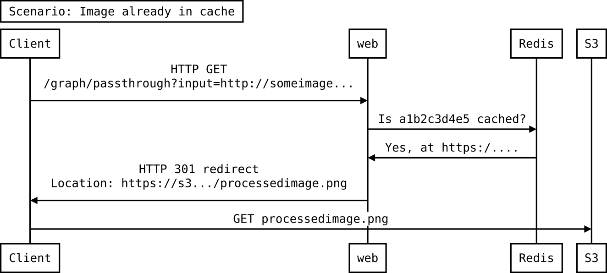
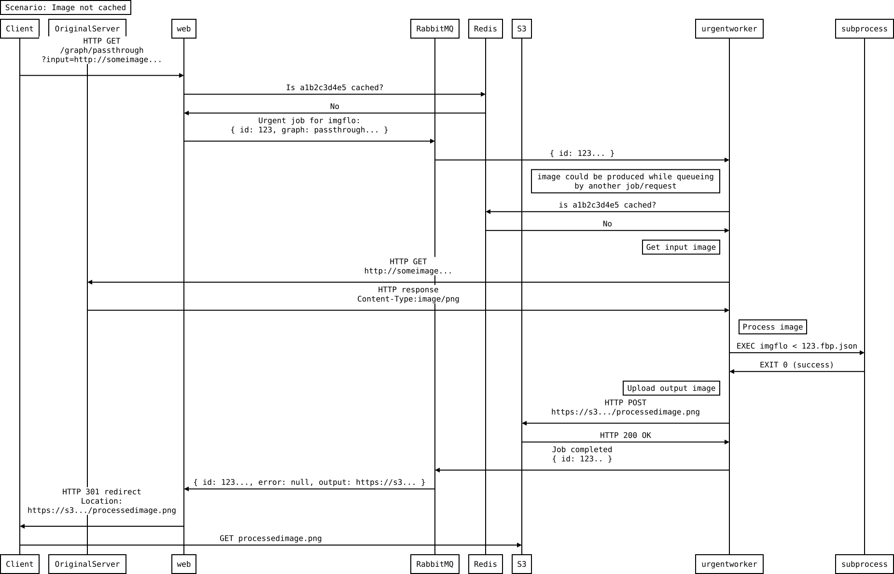

## Responsibilities 

imgflo-server is an image *processing* Service.

* Service processes new images from input images, on behalf of a `Client`.
* Client is responsible for fully specifying the processing to be done, and notify the Service via HTTP requests.
* Service does not host/serve the images, this is deferred to a standard HTTP hosting service/CDN like Amazon S3.

## API

`TODO: Link documentation here`

## Components

The major pieces of the service that are part of the imgflo project are

* HTTP API frontend. [./src/server.coffee](../src/server.coffee). Handles HTTP requests coming from Client.
* Processing worker. [./src/worker.coffee](../src/worker.coffe). Recieves jobs via AMQP
* Image processing runtime. [imgflo/imgflo](https://github.com/imgflo/imgflo)

Additionally, a number of external software components are used.
Each of these dependencies have a thin layer of code which defines the interface used,
to keep idiosynracies of the concrete implementation used from spreading too much in the codebase.

* Cache database. [Redis](https://redis.io/). [./src/redis.coffee](../src/redis.coffee)
Stores which cache entries exists, and where the result is.
* Message broker. [RabbitMQ](https://www.rabbitmq.com/).
For communicating between workers using AMQP.
* Image blob storage. [Amazon S3](https://aws.amazon.com/s3). [./src/s3.coffee](../src/s3.coffee)
Hosts and serves the processed images.
* Alternative image processing runtime: [NoFlo](https://noflojs.org) + noflo-image + noflo-canvas.
Can be used in addition to `imgflo`.

Communication over AMQP/RabbitMQ is done via [MsgFlo](https://msgflo.org).

## Interactions

Shown here as [UML sequence diagram](http://en.wikipedia.org/wiki/Sequence_diagram),
created with [js-sequence-diagrams](https://bramp.github.io/js-sequence-diagrams).

These are the prototypical scenarios for a request, shown separately.
In a real-life deployment, many (10-1000) requests happen concurrently.
Error-conditions are not covered, but generally follows the same paths.

### Already cached image

Client requests an image which has been processed previously, and already exists in cache.
This is the simplest case, and the most performant, and the most common (in terms of number of requests).

[DSL](./already-cached.sequence.txt) |
[.SVG](./already-cached.sequence.svg)

Typically time spent in imgflo `web` from Client request to response is `<<100ms`.

### Image must be processed urgently 

Client requests an image which has *not* been processed before.
It does not exist in the cache, and must be processed and put into cache.

[DSL](./process-urgent.sequence.txt)|
[.SVG](./process-urgent.sequence.svg)

Typical time spent in imgflo is `~5000ms`. With variable load there is a large variance,
as jobs may need to wait in the RabbitMQ queue until a worker accepts new jobs.
Client response `within 30 seconds` is available for `>99%` of requests.

### Pre-heat image cache

Client requests an image to be processed, without waiting for the result.

`TODO: illustrate`
